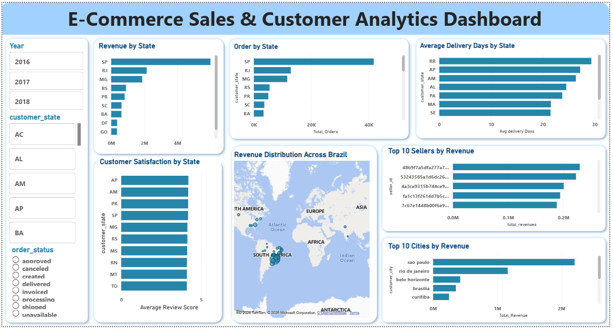

# E-Commerce Sales & Customer Analytics Project
This project analyzes customer orders, payments, delivery performance, and customer reviews using the Olist E-Commerce dataset. The objective is to generate business insights that support data-driven decision-making through Python, PostgreSQL, and Power BI.

# Dataset Information 
Dataset: Olist E-Commerce Dataset
- The original Olist dataset contains multiple relational tables with over 100,000 records.
- Dataset link :-
  https://www.kaggle.com/datasets/olistbr/brazilian-ecommerce

Key Columns:- 
Customer ID, Order ID, Customer State, Order Status, Payment Type, Payment Value, Review Score, Delivery Dates

Tools & Technologies:- 
Python (Pandas, NumPy, Jupyter Notebook)
PostgreSQL
SQLAlchemy
Power BI
GitHub

# Project Workflow
Data Cleaning:- 
Handled missing values , Removed duplicates , Validated data quality , Converted date columns

SQL Analysis:- 
Total Revenue Analysis , Total Orders Analysis ,
Top Cities by Orders , Revenue vs Review Score

Dashboard Creation:- 
Created an interactive Power BI dashboard containing:
- Executive KPIs
- Sales Analytics
- Customer Analytics
- Operations Analytics
The dashboard provides interactive filtering, sales trend visualization, and business performance insights.

# Key Insights
 Revenue is concentrated in a few major states. 
 A small number of sellers generate a large share of revenue. 
 Monthly revenue shows seasonal trends.

# Dashboard Preview
#### Executive Overview

### Customer & Operations Analysis

### Product & Sales Performance

# Project Structure
E-Commerce-Sales-Customer-Analytics/
│
├── notebooks/
│   └── ecommerce_sales_Customer_analytics.ipynb
├── sql/
│   └── ecommerce_sales_customer_analytics.sql
├── powerbi/
│   └── ecommerce_sales_customer_analysis.png
└── README.md
