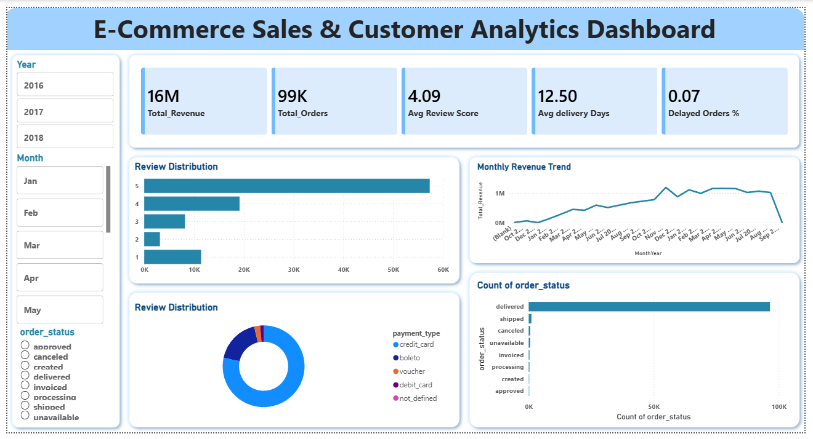
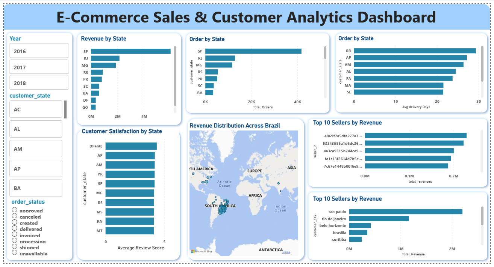
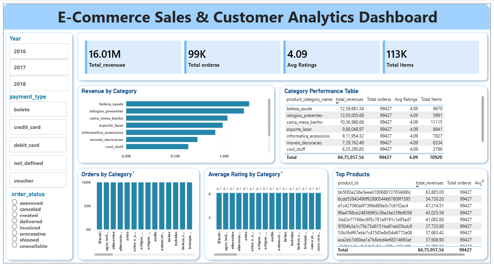

# E-Commerce Sales & Customer Analytics Project
This project analyzes customer orders, payments, delivery performance, and customer reviews using the Olist E-Commerce dataset. The objective is to generate business insights that support data-driven decision-making through Python, PostgreSQL, and Power BI.

# Dataset Information 
Dataset: Olist E-Commerce Dataset
- The original Olist dataset contains multiple relational tables with over 100,000 records. For this project, the relevant tables were merged and transformed into an analytical dataset containing approximately 3,900 records and 18 features for reporting and dashboard development.

Key Columns:- 
Customer ID, Order ID, Customer State, Order Status, Payment Type, Payment Value, Review Score, Delivery Dates

Tools & Technologies:- 
Python (Pandas, NumPy, Jupyter Notebook)
PostgreSQL
SQLAlchemy
Power BI
GitHub

# Project Workflow
Data Cleaning:- 
Handled missing values , Removed duplicates , Validated data quality , Converted date columns , Created analytical features 

Exploratory Data Analysis (EDA):- 
Customer analysis , Order analysis , Payment analysis , Review score analysis , Delivery performance analysis

SQL Analysis:- 
Total Revenue Analysis , Total Orders Analysis ,
Top Cities by Orders , Revenue vs Review Score

Dashboard Creation:- 
Created an interactive Power BI dashboard containing:
- Executive KPIs
- Sales Analytics
- Customer Analytics
- Operations Analytics
The dashboard provides interactive filtering, sales trend visualization, and business performance insights.

# Key Insights
Revenue is concentrated in top-performing regions.
Customer satisfaction impacts business performance.
Delivery delays can affect review scores.
Certain payment methods dominate customer transactions.

# Dashboard Preview
#### Executive Overview

### Customer & Operations Analysis

### Product & Sales Performance

# Project Structure
E-Commerce-Sales-Customer-Analytics/
│
├── notebooks/
│   └── ecommerce_fraud_analysis.ipynb
├── sql/
│   └── ecommerce-1.sql
├── powerbi/
│   └── ecommerce_fraud_analysis.pbix
├── reports/
│   └── project_report.pdf
└── README.md

# Future Improvements
Sales Forecasting, 
Customer Segmentation, 
Real-Time Dashboard Integration
